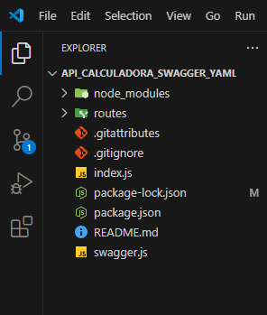

# api_calculadora_swagger_yaml
<b>Obs: descompacte o node_modules ( parte 1 e 2 e coloque no mesmo diretório ) </b> 
<h2>Primeiro passo:</h2>

<h2>Segundo passo:</h2>

<h2>Terceiro passo:</h2>

<h2>Organização de pastas</h2>

